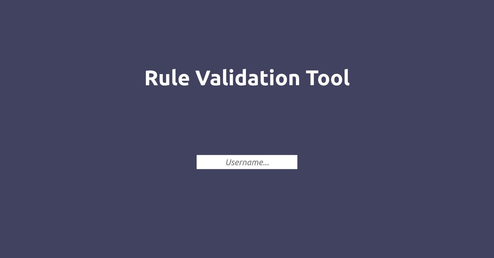

# Getting started

### Configuration

To be able to mine annotation usage rules, the tool requires three things:
- target projects to mine the rules from
- jar files for resolving the types of imported classes, annotations, etc. If not provided, it falls back to a heuristic which may not always produce accurate results
- `configuration.json` file that specifies what APIs we want to mine rules for

The first two parameters can be provided through mounting existing directories to provided volumes in the [`docker-compose.yml`](./docker-compose.yml) file (see `volumes` section in the `miner` service). Additionally, we also provide means to download the target projects and jar files. See [this section](#downloading-projects-and-jar-files).

`configuration.json` file contains the necessary information about the APIs we are interested in mining. Example file:

```json
{
    "api": {
        "prefixes": [
            "org.eclipse.microprofile",
            "javax",
            "jakarta"
        ],
        "subApi": {
            "prefixes": [
                "org.eclipse.microprofile.config",
                "org.eclipse.microprofile.faulttolerance",
                "org.eclipse.microprofile.graphql",
                "org.eclipse.microprofile.health",
                "org.eclipse.microprofile.jwt",
                "org.eclipse.microprofile.metrics",
                "org.eclipse.microprofile.openapi",
                "org.eclipse.microprofile.opentracing",
                "org.eclipse.microprofile.reactive",
                "org.eclipse.microprofile.rest",
                "org.eclipse.microprofile.auth"
            ]
        }
    }
}
```

We simply need two types of `prefixes` for the configuration:

- `api#prefixes` is used to make sure the provided rules only contain classes/annotations that belong to these namespaces. 
- `api#subApi#prefixes` is used to group the annotation usages based on the sub-APIs, and perform the mining for each sub-API individually where mining parameters are automatically configured according to the size of each group.

### Building and running

Once configuration is done, build and run the application. We can build the application using [`build.sh`](./build.sh) command. Once the project is successfully built, we can run it using [`run.sh`](./run.sh) command. A successful execution will land you in the `bash`.

```
bash5-1# 
```

You can use the `info` command to get more information.

```
bash-5.1# info

This tool allows you to mine candidate annotation usage rules 
from the target projects located in '/pipeline/mining-sources'.
Once you mine candidate rules, you can review and validate them 
using the Rule Validation Tool (RVT). Confirmed rules can be exported 
to be used for misuse detection.

Available commands:
	 mine                  - Mines candidate rules from target projects located in /pipeline/mining-sources
	 validate              - Uploads the mined candidate rules into the RVT for validation
	 export-rules          - Exports the validated correct rules from RVT
	 build-detector        - Builds the misuse detector Maven plugin jar file, and provides installation directions
	 download-jars         - Downloads the required jar files mentioned in /pipeline/config/configuration.json file
	 clone-projects        - Clones the projects mentioned in the input file into /pipeline/mining-sources directory
	 info                  - Shows information about the available commands
```

We have 7 commands each performing different tasks. We now will describe each command individually.

### Mining

Assuming that we have configured the `mining-sources` and `lib-sources` accurately, to start the mining process, all we need to do is to issue the `mine` command. That's it! Once the mining process is done, it will save the candidate rules to the `/pipeline/exports` directory (the name template is `candidate_rules_{current_milliseconds}.json`). 

### Validation

Once the candidate rules are mined, we can move on to the validation. To perform the validation, we need to upload the candidate rules to our Rule Validation Tool (RVT). To do this, we simply need to issue the `validate` command. This command will upload the candidate rules to RVT and provide a random username for accessing those rules. Example execution:
```
bash-5.1# validate
Using the following rules file for the validation: /pipeline/exports/candidate_rules_1663128572285.json
No username has been provided, generating a random one...
==========================================================
Successfully loaded the mined candidate rules!
To start validating candidate rules, please head over to:
	http://localhost:8888
	Username: magnetic-gallery
==========================================================
```

You can also provide a custom username using `--user USERNAME` option:

```
bash-5.1# validate --user microprofile-rules
```

All you have to do is to put the username in the login field in the RVT login page and hit Enter.

<p align="center">
  
</p>

To learn more about how to use RVT and its domain-specific language, please head over to [tutorial](./ui/tutorial/README.md).

**Note.** The `validate` command picks the most recent candidate rules file based on the timestamp (milliseconds) provided in the name of the file.

### Export

Once the validation is complete (which does not equate to validating all the candidate rules necessarily), we can export the confirmed rules from RVT. To do this, we can issue the `export-rules` command. Example command:

```
bash-5.1# export-rules 
Exported the confirmed rules to: /pipeline/exports/confirmed-magnetic-gallery.json
```

**Note.** The `validate` command saves the provided or the generated username to `/tmp/rvt_most_recent_login` file which is the reason why we do not need to supply the username to the `export-rules` command after we run `validate`. However, since `/tmp/rvt_most_recent_login` is a temporary file, if we want to export rules for another username (or if we have restarted the container), we can supply a custom username as follows: `export-rules --user microprofile-rules`.

### Building the misuse detector

We can use the exported confirmed rules for building a misuse detector. To build the misuse detector, we only need to issue the `build-detector` command which will package our misuse detector Maven plugin with the exported rules and the jar files required for type resolving into a single jar file. This jar file, alongside a Shell script to install it will be available in `/pipeline/exports/detector/` directory. You can issue the install command from your host machine or any other device that has Java and Maven installed.

**Note.** Similar to the `validate` and `export-rules` commands, you can also supply a custom username to the `build-detector` command using `--user USERNAME` option. Since the confirmed rules contain the username that they belong to, this option allows us to pick anything other than the most recent username.

### Running the detector

Since the detector is a Maven plugin, we need to run it in a project where a `pom.xml` is present. A very simple example:

```
# mvn ca.ualberta:violation-detector-maven-plugin:scan
```

To learn more about running the detector, please see the **How to use the plugin** section in [the following tutorial](./violation-detector/README.md#how-to-use-the-plugin).

### Downloading projects and jar files

Our tool provides two commands for downloading jar files, and cloning the target projects from GitHub. 

- **Downloading JARs**. To download the jars, you can add an array called `"jarFiles"` to `configuration.json` file where each element in the array represents a jar file that will be downloaded from Maven Central. The format for each entry is `groupId:artifactId:version`. Once the configuration.json file contains all the entries, you can issue the command `download-jars` command. If you have already mounted an existing directory to `lib-sources` volume, please be aware that the `download-jars` command will not delete or re-download existing jar files. Example command:
```shell
bash-5.1# download-jars # no parameter required
```

- **Cloning projects**. To clone target projects from GitHub, you can use `clone-projects` command which takes a path to a file where all the projects are mentioned. Check out an example file [here](./config/projects.txt). The format for an entry is that the first line is the GitHub link, the next line may have a commit hash (will checkout the master/main branch if none specified), and finally "--" (dashes) are used as the separator. Putting any file in the [`config`](./config/) directory will result in that file being copied to the container. Finally, the projects will be downloaded to `/pipeline/mining-sources` directory in the container. Example command: 
```shell
bash-5.1# clone-projects /pipeline/config/projects.txt
```
