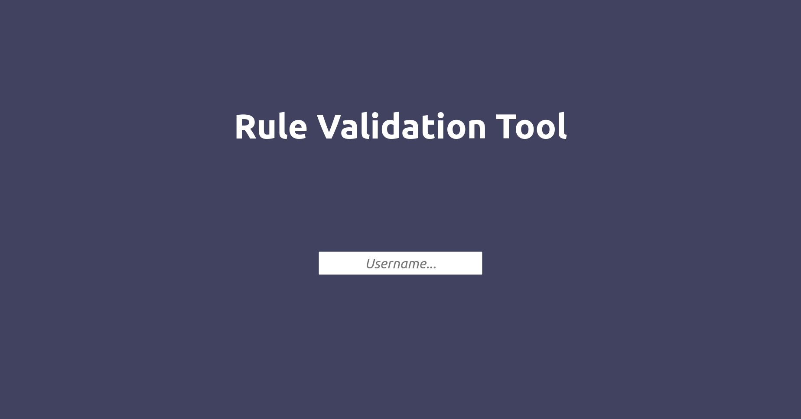
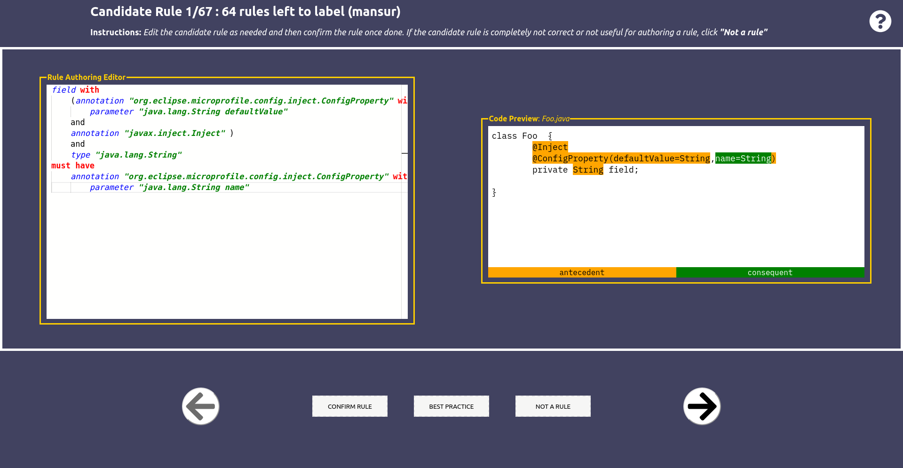

# Pipeline for producing annotation usage rules  

Note: For the version of the repository that we used for the CASCON 22 paper, please refer to the [following release](https://github.com/ualberta-smr/generating-annotation-usage-rules/releases/tag/v_cascon).

In this work, we create a human-in-the-loop pipeline to produce accurate annotation usage rules. The pipeline includes the following steps:
1. Mining candidate annotation usage rules (see [this repo](https://github.com/ualberta-smr/MiningAnnotationUsageRules) for more details)
2. Validating the candidate usage rules to produce confirmed usage rules (using the Rule Validation Tool)
3. Using confirmed usage rules for misuse detection purposes (using the Violation Detector)Getting started

Published papers:

> [*Mining Annotation Usage Rules: A Case Study with MicroProfile*](https://hifromajay.github.io/papers/icsme22.pdf). Batyr Nuryyev, Ajay Kumar Jha, Sarah Nadi, Yee-Kang Chang, Emily Jiang, Vijay Sundaresan. ICSME'22: Industry Track.

> [*A Human-in-the-loop Approach to Generate Annotation Usage Rules: A Case Study with MicroProfile*](https://karimali.ca/resources/papers/rvt.pdf). Mansur Gulami, Ajay Kumar Jha, Sarah Nadi, Karim Ali, Yee-Kang Chang, Emily Jiang. CASCONxEVOKE '22.

## Requirements

- Docker (tested on version 20)
    - The build files make use of [BuildKit](https://docs.docker.com/develop/develop-images/build_enhancements/) for caching purposes which were introduced in version 18.09. This means that the minimum Docker version required is 18.09.
- Docker Compose (tested on version 1.25)
- The following ports need to be free to make sure the application is running correctly:
    - 3306 - mysql
    - 5000 - backend
    - 8000 - ui tutorial
    - 8888 - ui

## Documentation

The complete documentation is provided in [DOCS.md](./DOCS.md)

## Quick start

The pipeline has three major steps (i.e. mining, validating, creating the misuse detector) and there are commands available to perform each of these steps, and some other auxillary commands. In this section, we will quickly demonstrate each step so that the overall flow will be clearer. 

### Building and running

To be able to use the pipeline, we need to build it first, and then run it. We can use [`build.sh`](./build.sh) and [`run.sh`](./run.sh) commands to achieve this as follows:

```shell

your-host-machine> ./build.sh && ./run.sh
# some build related output
# ...
========================================================================
This tool allows you to mine candidate annotation usage rules 
from the target projects located in /pipeline/mining-sources.
Once you mine candidate rules, you can review and validate them 
using the Rule Validation Tool (RVT). Confirmed rules can be exported 
to be used for misuse detection.

Available commands:
	 mine                  - Mines candidate rules from target projects located in /pipeline/mining-sources
	 validate              - Uploads the mined candidate rules into the RVT for validation
	 export-rules          - Exports the validated correct rules from RVT
	 build-detector        - Builds the misuse detector Maven plugin jar file, and provides installation directions
	 download-jars         - Downloads the required jar files mentioned in /pipeline/config/configuration.json file
	 clone-projects        - Clones the projects mentioned in the input file into /pipeline/mining-sources directory
	 info                  - Shows information about the available commands
pipeline> 
```

A successful execution should land you in the bash shell, and information about all the available commands should be printed. Now the pipeline is ready!

### Mining

To be able to mine candidate annotation usage rules (a.k.a. _candidate rules_), we need two inputs: 
    
1. a set of Java projects that we will use for mining
2. a set of JAR files for resolving the types that we are interested in

You can provide your own set of Java projects for mining (input 1) as well, but for the purpose of this demo, we will clone some predefined MicroProfile projects. To do this, please issue the following command:

```shell
pipeline> clone-projects --file /pipeline/examples/example_projects.txt
```

This will download all the projects defined in the [example_projects.txt](./examples/example_projects.txt) file into `/pipeline/mining-sources` directory. 

Next, we need to download the JAR files. To do this, please issue the following command:

```shell
pipeline> download-jars
```

This will download all the JAR files mentioned in the [`configuration.json`](./config/configuration.json) file into the `/pipeline/lib-sources` directory.

Now, we are ready to mine! To mine candidate rules, we can simply use the following command:

```shell
pipeline> mine
```

Mining candidate rules might take a while, which is why we provide [an example output file](./examples/candidate_rules_example.json) that can be used in the validation process which is described in the next section.

### Validation

The next step after mining is to validate the candidate annotation usage rules. Usually, once the mining step is done, it is enough to issue the `validate` command to use the newly produced candidate rules for validation. 

However, if you have skipped the mining section and want to see how the validation works, we provide [an example file](./examples/candidate_rules_example.json) with 6 candidate rules. To validate these rules, issue the following command:

```shell
pipeline> validate --file /pipeline/examples/candidate_rules_example.json

Using the following rules file for the validation: /pipeline/examples/candidate_rules_example.json
No username has been provided, generating a random one...
==========================================================
Successfully loaded the mined candidate rules!
To start validating candidate rules, please head over to:
	http://localhost:8888
	Username: magnetic-gallery
==========================================================
```

Now, all you need to do is to go to `http://localhost:8888` and log in with the provided username, and start validating the candidate rules. The landing page will look something like this:

<p align="center">
  
</p>

and once logged in, the rule validation page should look like this:

<p align="center">
  
</p>

To get familiar with the validation tool and the domain-specific language used for validating the rules, please head over to the [tutorial page](./ui/tutorial/README.md) (it is also accessible from the UI using the question mark (?) button at the top right corner).

Once you're done with validation (which does not mean validating all the candidate rules necessarily), you can simply close the browser tab.

### Building the detector

Once the validation is done, we can move on to building the detector which consists of two steps. 

1. Exporting the confirmed rules
2. Building the detector

Please note that if you have skipped the mining step entirely, and have not yet downloaded the jar files, please issue the following command to do it, as those jars are required for building the detector.

```shell
pipeline> download-jars
```

To perform both, simply run the command:

```shell
pipeline> export-rules && build-detector
```

However, if we simply want to build the detector from some predefined confirmed rules, issue the following command:

```shell
pipeline> build-detector --file /pipeline/examples/confirmed_rules_example.json
```

After a successful execution, please head over to `/pipeline/exports/detector` directory where you'll find `install-plugin.sh` alongside a JAR file of the detector. The `/pipeline/exports` directory is a volume, and by default it is mounted to a directory called `exports` in the project root in the host machine. You can try installing the detector using the provided script in your host machine.

You can also install the plugin within the pipeline and test it on a dummy project. To do it, you need to first install the plugin:

```shell
pipeline> pwd
/pipeline/exports/detector
pipeline> ./install-plugin.sh
# it will install the plugin
```

and then go to the dummy project directory, and issue the scanning task

```shell
pipeline> cd /pipeline/examples/example_project
pipeline> mvn ca.ualberta:violation-detector-maven-plugin:scan
```

After a successful execution, it should print out the misuses of "Rule-1".

## Struggling with some steps?

File an issue on this repo and we will get back to you asap.

## Contributor

[Mansur Gulami](https://www.github.com/mensurowary)

## Credit
All credit related to RulePad goes to [Sahar Mehrpour](https://github.com/SaharMehrpour)