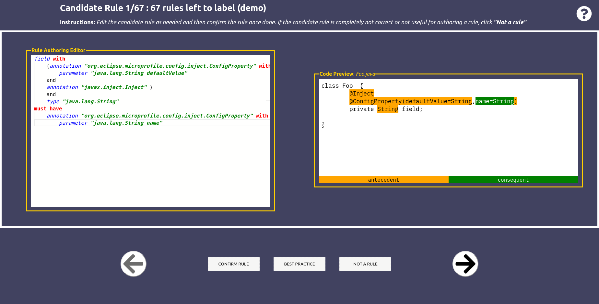
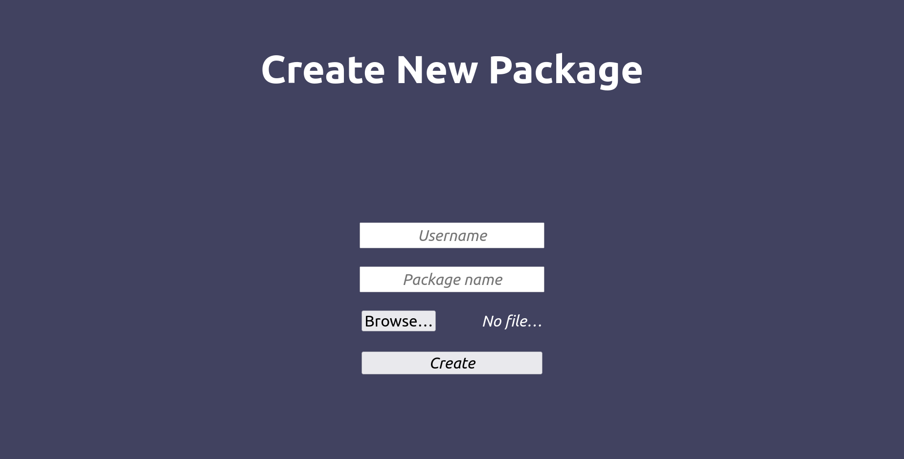

# Rule Validation Tool

The complete project of the Rule Validation Tool (RVT). This tool presents the mined candidate rules to the users and allows them to validate rules.

It consists of 2 pieces:
- [frontend](./frontend/)
- [backend](./backend/)

## How to run

To run the project, simply run the start script:

```shell
./start.sh # by default runs on `localhost`
# or
./start.sh IP_ADDRESS_OF_SERVER # if you run it in a server at the address of IP_ADDRESS_OF_SERVER
```

Please note that it takes time for the backend to properly start because it waits for the database to become fully functional. Once everything is set up, head over to `localhost` or `IP_ADDRESS_OF_SERVER` without specifying any port. You will be greeted with a login screen. 

<p align="center">
  
</p>

Currently, there are five hard-coded usernames: mansur, ajay, demo, user2, user3 (see [users.py](./backend/src/db/users.py)). Once you logged in, you will see all the rules that need to be validated by the current user.

<p align="center">
  
</p>

# Input Candidate Rules

RVT accepts the format that [the rule miner](https://github.com/ualberta-smr/MiningAnnotationUsageRules) uses for producing the candidate rules. RVT simply takes the output file of the mining process and converts each mined rule to the extended RulePad format.  [This](./backend/data/evaluation/original12.json) is an example JSON file we use. To create your own users and a set of rules to validate, you can either hardcode it in the code, or head over to `http://localhost/package` in the browser.

<p align="center">
  
</p>

To export all the rules that a particular user has validated, send a simple GET request to `http://localhost:5000/packages/{USERNAME}/confirmed` (e.g., `http://localhost:5000/packages/demo/confirmed`). The response will contain all the rules confirmed by a particular user. This JSON response can then be simply imported to the Maven plugin (see [here](../violation-detector/violation-detector-maven-plugin/src/main/resources/)). 