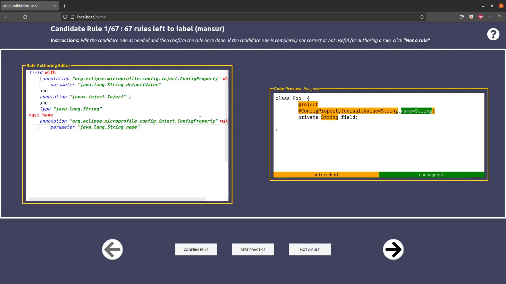

# Tutorial

During the experiment, you will be using the Rule Validation Tool where MicroProfile candidate usage rules will be provided. Your goal is to determine if these candidate rules are correct rules that must be respected for the MicroProfile annotation to work correctly. The candidate rules are going to be provided in a Domain Specific Language (DSL) called [Rulepad](https://github.com/devuxd/active-doc-client). We provide more information below. Please use recent versions of either Google Chrome or Mozilla Firefox browsers.

## Rule Validation Tool

This is how the tool overall looks like: 

<p align="center">
  
</p>

Candidate rules are presented using the Rule Authoring Editor (on the left) in Rulepad format. There are 5 actions you can do with the Rule Validation Tool.

1. You can edit the presented rule using the Rule Authoring Editor. Note that the changes you make are reflected in the Code section on the right. The code snippet helps you see what the rule you are working on would look like as code. More information on its format is provided below.

<p align="center"></p>

2. You can format the presented rule to make it more readable

<p align="center"></p>

3. You can confirm the rule.

<p align="center"></p>

4. You can reject the rule

<p align="center"></p>

5. By clicking on the picked label again you can un-label.

<p align="center"></p>

## Note. 

**Changes you make to a rule will only be saved if you click the Confirm Rule button**. In any other case, the changes will not be saved. For example, the changes in the following cases the changes will be lost:
- Moving on to another candidate rule will get rid of any unsaved changes without any warning. 
- The changes made to an already confirmed rule will be lost if those changes are not saved again using "CONFIRM RULE" button.

The code section shows the Java equivalent of the presented rule. IF (antecedent) and THEN (consequent) parts are shown in distinct colors. 

<p align="center">
  
</p>

## Rulepad

Rulepad DSL (domain specific language) resembles English language. It has a IF-THEN structure. 

Here are some Rulepad example statements alongside with their Java code equivalents:

<table>
<tr>
<th colspan="2">Rulepad Examples</th>
</tr>
<tr>
<th>Rulepad</th>
<th>Java</th>
</tr>
<tr>
<td>

```
class with annotation "A" must have annotation "B"
```
</td>
<td>

```java
@A
@B
class Foo {}
```
</td>
</tr>

<tr>
<td>

```
field with type "A" must have annotation "B" or annotation "C"
```
</td>
<td>

```java
class Foo {
    @B // or @C
    A dummyField;
}
```
</td>
</tr>

<tr>
<td>

```
method with parameter with type "A" must have return type "B" and annotation "C"
```
</td>
<td>

```java
class Foo {

    @C
    B dummyMethod(A paramFoo) {
       /*ignored*/ 
    }
}
```
</td>
</tr>

</table>

### Syntax

In Rulepad, we describe rules about Java program elements. Each program element can have different properties. When we want to specify different properties for a program element, we use `with` keyword (e.g., `field with type "String"`). Statements consist of 2 parts: (1) IF part that is before _must have_ and (2) THEN part which is after _must have_. There is a general structure for all the statements:

```
programElement with programElementExpression must have programElementExpression
```

Although there are 13 program elements that we can specify, **the actual statements need to describe either a class, a method or a field**. So, in the structure given above `programElement` can be either `class`, `method` or `field`. 

For each program element, `programElementExpression` represents the properties that can belong to that program element. `programElementExpression` can take an aggregate form, meaning we can use `AND`s and `OR`s to combine multiple properties (see [aggregates](#aggregates-and-parenthesis)) 

#### annotation

`annotation` has 2 properties that we can use: `type` and `parameters`. 

- Type is mandatory when it comes to annotations. `@Override` should be written as `annotation "Override"`. 
- Annotations may also have annotation parameters. `@ConfigProperty(name=...)` should be described as `annotation "ConfigProperty" with parameter "name"`

#### annotation parameter

Annotation parameters have 3 properties: `type`, `name` and `value` (basically, `@Type(name=value)`). Examples:
- A _String_ parameter should be described as `parameter with type "String"`
- A parameter with name _maxInterval_ should be described as `parameter with name "maxInterval"`
- A parameter with value _enabled_ should be described as `parameter with value "enabled"`

There're shortcuts available for annotation parameters. These are the following:
- Instead of `parameter with name "maxInterval"`, we can say `parameter "maxInterval"`
    - So, if we want to say `parameter with name "fallback" and value "enabled"`, it can be simplified to `parameter "fallback" with value "enabled"`
- Instead of `parameter with type "long" and name "maxInterval"`, we can say `parameter "long maxInterval"`

#### type

Types only have 1 property and that's the name of the type. For example, _String_ type should be described as `type "String"`

#### name

Names only have 1 property and that's the name string. For example, something with name _maxInterval_ should be written as `name "maxInterval"`.

#### value

Values only have 1 property and that's the value string. For example, something with the value of _enabled_ should be written as `value "enabled"`. By default value string matches the literal value. So, `value "enabled"` is equal to `@Dummy(param="enabled")`. See [this section](#special-use-case-combining-annotation-parameter-values-and-configuration-properties) to learn about dynamic value placeholders and their only usecase.

#### field

Fields can have 3 properties: `annotation`, `type` and `configuration file`. Examples:

- A field with annotation _Inject_ will be `field with annotation "Inject"`
- A field with _String_ type will be `field with type "String"`

Configuration file example is explained [here](#configuration-file-and-configuration-property)

#### method

Methods can have 4 properties: `annotation`, `return type`, `parameter` and `configuration file`. Examples:

- A method with annotation _GET_ will be `method with annotation "GET"`
- A method with a return type of _String_ will be `method with return type "String"`
- A method with _String_ parameter will be `method with parameter "String"` 

Configuration file example is explained [here](#configuration-file-and-configuration-property)

#### method parameter

Method parameters can have 3 properties: `type`, `name` and `annotation`. Examples:
- A _String_ parameter should be described as `parameter with type "String"`
- A parameter with annotation _PathParam_ should be described as `parameter with annotation "PathParam"`
- A parameter with name _inputString_ should be described as `parameter with name "inputString"`

There're shortcuts available for method parameters. These are the following:
- Instead of `parameter with type "String"`, we can say `parameter "String"`
- Instead of `parameter with type "long" and name "maxInterval"`, we can say `parameter "long maxInterval"`

#### class
`class` can have 7 different properties: 
- annotation
- field
- method
- extension
- implementation
- bean declaration
- beans file
- configuration file

Here are some examples:
- A class with the annotation _Path_ should be described as `class with annotation "Path"`
- If a class has a _String_ field, it should be described as `class with field with type "String"`
- If a class has a method that has been annotated with _GET_, it should be described as `class with method with annotation "GET"`
- If we want to specify that a class is extending _HealthCheck_ class, it should be described as `class with extension of "HealthCheck"`
- If we want to specify that a class is implementing _Health_ interface, it should be described as `class with implementation of "HealthCheck"`
- If we want to specify that a class has been declared as a bean in _beans.xml_, it should be described as `class with bean declaration`
- If we want to specify that there exists a _beans.xml_ file, it should be described as `class with beans file`

`extension of`, `implementation of`, `beans file` and `bean declaration` are exclusive to classes. `beans file` and `bean declaration` does not have any properties. `extension of` and `implementation of` can only specify what class they are referring to (examples given above).

Configuration file example is explained [here](#configuration-file-and-configuration-property)

#### configuration file and configuration property

In our context, configuration file refers to the `microprofile-config.properties`. Configuration file only has 1 program element which is a configuration `property`.

Configuration properties have 3 properties: `type`, `name` and `value`. Examples:
- A _String_ property should be described as `property with type "String"`
- A property with name _maxInterval_ should be described as `property with name "maxInterval"`
- A property with value _enabled_ should be described as `property with value "enabled"`

There're shortcuts available for configuration properties. These are the following:
- Instead of `property with name "maxInterval"`, we can say `property "maxInterval"`
    - So, if we want to say `property with name "fallback" and value "enabled"`, it can be simplified to `property "fallback" with value "enabled"`
- Instead of `property with type "long" and name "maxInterval"`, we can say `property "long maxInterval"`


#### Special use case: combining annotation parameter values and configuration properties

```java
@ConfigProperty(name="maxInterval")
int maxInterval;
```

In order for the code above to work properly, `maxInterval` needs to be available in the config source. We cannot just say `...configuration file with property "maxInterval"` because the value of the _name_ parameter is dynamic, it can be something else as well. So, we need to refer to the dynamic value somehow. That's where the _value placeholders_ come in. 

We can grab the _maxInterval_ value by saying `...parameter "name" with value "[nameValue]"` and use it in the configuration property declaration. So, the complete rule will be:

```
field with annotation "ConfigProperty" with parameter "name" with value "[nameValue]" 
must have
configuration file with property "[nameValue]"
```


#### Aggregates and Parenthesis

Properties of program element can be combined as well. We currently have 2 aggregation operation: AND and OR. Examples:

- `class with annotation "A" must have annotation "B" or annotation "C"`
- `field with type "A" must have annotation "B" and annotation "C"`
- `method with return type "A" must have annotation "B" or parameter with type "C"`

There's a shortcut available for annotations if one wants to specify multiple annotations from the same package with OR operation. Consider the case when you want to say `@javax.ws.rs.GET or @javax.ws.rs.POST or @javax.ws.rs.DELETE or @javax.ws.rs.PUT`. With the usual Rulepad syntax it would be:

```
annotation "javax.ws.rs.GET" or annotation "javax.ws.rs.POST" or annotation "javax.ws.rs.DELETE" or annotation "javax.ws.rs.PUT"
```

but we can group them together and write it as:

```
annotation "javax.ws.rs.[GET|POST|DELETE|PUT]"
```

This shortcut should only be used to specify different annotations from the same package and not with combination of multiple packages (_e.g., avoid doing something like `"a.b.[c.[X|Y]|M|N]"`_) 

We can also use parenthesis to group things together to avoid ambiguities.

- `class with (field with type "A" and annotation "B") must have ... `
- `class with (field with type "A") and annotation "B" must have ... `

<style>{less: custom.css}</style>